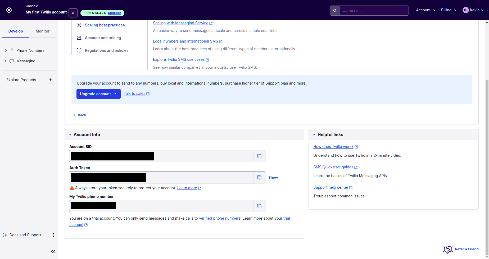
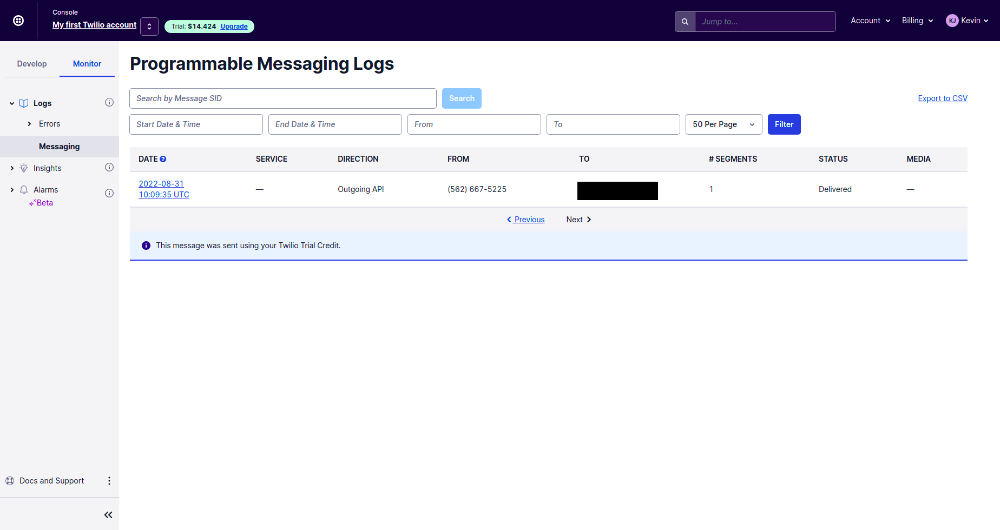
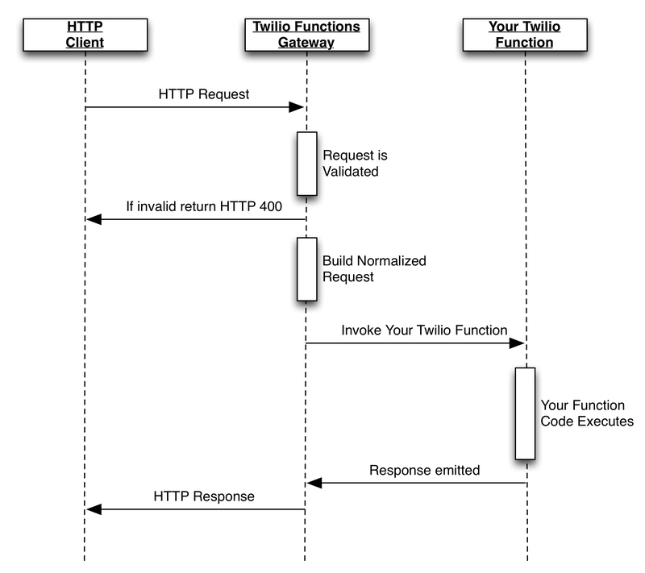
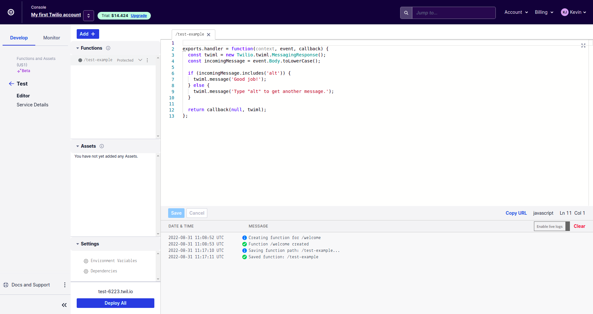
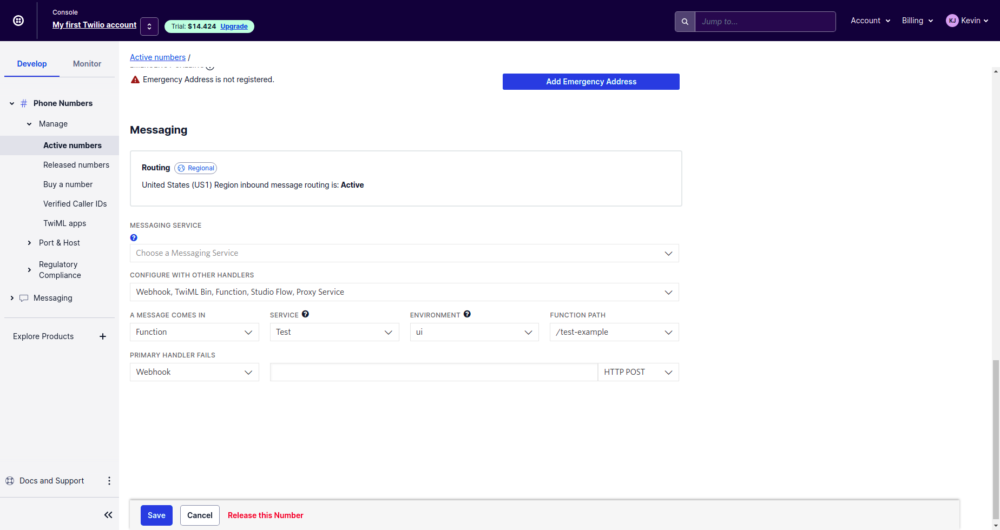
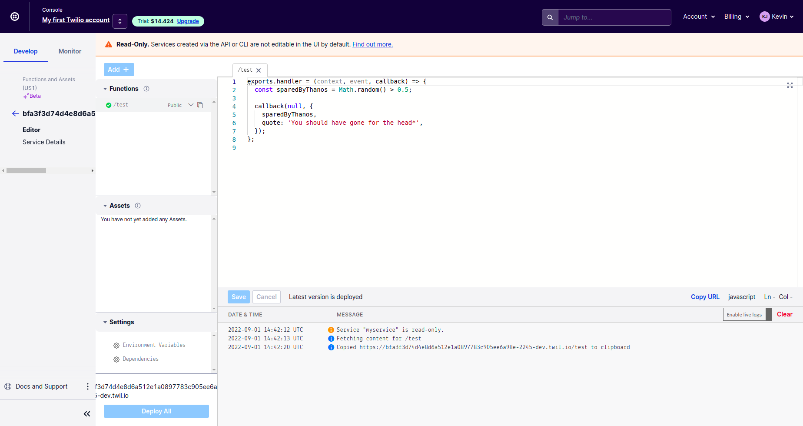
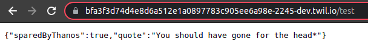
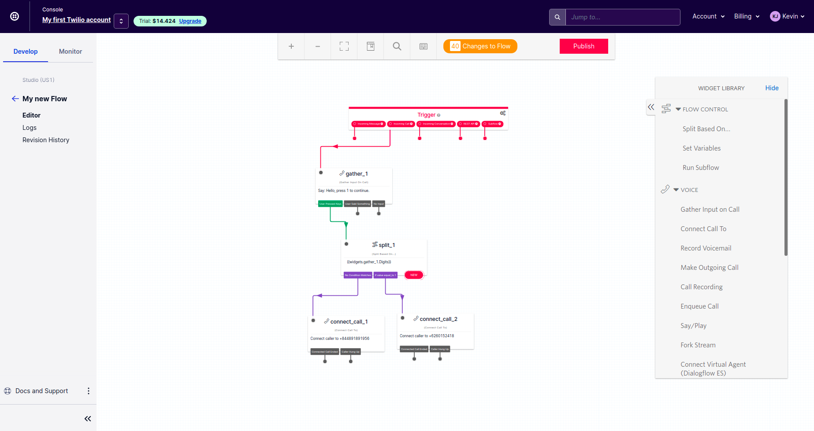

# LABORATORY-TWILIO

Twilio is a service for sending SMS and handling system around SMS and Call. This project is a laboratory where I am testing some of the feature of Twilio such as the REST API, the IVR, the Serverless functions. I build the project in a **NX Workspace** with one **react** app handling the frontend and a **express** app for handling all my call to the **Twilio API**.

## Plan of the presentation

I explain with all the details how I build the project and my way of working.

- [Theory](#theory)
- [Experiences](#experiences)
- [Running](#running)
- [System](#system)

## Experiences

The information for connecting the code to our account are all shown on the dashboard of our app.
Under the app that I am using for thie laboratory.



#### Experience1: Sendind a SMS using twilio

For sending a sms using twilio, you need to add your number in the **Verified Caller IDs** if you are using the trial version.
You can find this in the tab `develop` -> Phone numbers -> Manage -> Verified Caller IDs.


In the `api` project, the app.tsx is responsible for sending a SMS.

```js
const accountSid = process.env.TWILIO_ACCOUNT_SID;
const authToken = process.env.TWILIO_AUTH_TOKEN;
const client = require("twilio")(accountSid, authToken);

app.post("/send-sms", async (req, res, next) => {
  const { number } = req.body;

  const message = await client.messages.create({
    body: "This is the ship that made the Kessel Run in fourteen parsecs?",
    from: process.env.TWILIO_NUMBER,
    to: number || process.env.MY_NUMBER,
  });

  res.json(number);
});
```

The log of the message can be see in the tab `Monitor` -> Logs -> Messaging



#### Experience2: Serverless twilio function

Twilio has a serverless system for handling call and message sent to our active numbers.

When a person is calling our number the system send a request to the twilio function gateway. This gateway will try to validate the request and if everything went fine, it will transform this call into a payload for our function. In our function, we can play a song, play a text, take the input of the person calling and so on... Once the function has been executed, the response is sent back to the client through the gateway. The mermaid under show the principle:



**By the interface**

It's possible to define everything from twilio itself. In the tab `develop` -> Explore Product -> Functions and assets.



In the example above, I have define a simple conditionnal response if a SMS is sent to my number. In case the message contains `alt`, my function will take care to answer back `Good job`, in the contrary the message under will be sent back to the person texting.

For defining which function to play when receiving a message. We need on the active number page located in tab `develop` -> Phone numbers -> Manage -> Active Numbers. At the bottom of the page, we can chose which webhook or function to play when a message arrive. In my case, I choose the function created on the previous screenshot: `test-example`.




**By Code**

Of course, everything can be handle by code. The entire interface has a crud for every part of the serverless. But the concept is a bit long to put in place if we do every using the REST Api.


I have defines some of them in the api in the file `experience2`. For example, for creating a service, a simple call using our credential can be done as follow:

```js
router.post("/service", async (req, res) => {
  const { name } = req.body;

  const service = await client.serverless.v1.services.create({
    includeCredentials: true,
    uniqueName: crypto.randomBytes(20).toString("hex"),
    friendlyName: name,
  });

  res.json(service);
});
```

The response to this call is a SID, that will be used in almost all the other request. We particularly need it for the upload of function. If I have to use Twilio response, I will certainly do it this way:

- Create the entire service, environment and function using the interface where nobody have access
- In our project, the scripts will be sent to our repository and using a curl in the pipeline or a node.js script, I will upload the function on twilio. This way I have control over the twilio access.

In my example, I created a button for uploading a script from the `scripts` folder of the api.

```js
router.post("/upload", async (req, res) => {
  const { sid, fid, filename } = req.body;

  const serviceUrl = `https://serverless-upload.twilio.com/v1/Services/${sid}`;
  const uploadUrl = `${serviceUrl}/Functions/${fid}/Versions`;

  const form = new FormData();
  form.append("Path", "/" + filename);
  form.append("Visibility", "public");
  form.append(
    "Content",
    fs.createReadStream(`${__dirname}/assets/scripts/${filename}.js`),
    {
      contentType: "application/javascript",
    }
  );

  await axios.post(uploadUrl, form, {
    auth: {
      username: accountSid,
      password: authToken,
    },
    headers: form.getHeaders(),
  });

  res.json(true);
});
```

Once, I do everything in the order and using the right ID. I manage to deploy the API online and to access it using my browser. This function could have been use as a response from a call or SMS.




#### Experience3: Getting the logs of the messages

Just a simple example of how to get the logs of the message, it can be quite interesting if it need to be use on an external website.

#### IVR (Interactive Voice Record)

I have not got an opportunity to use this one professionally but Twilio also dispose of a very interesting system for creating IVR and Chatbot.



## Running

I am using NX, so for starting the project use the following command:

```bash
$ nx run-many --target=serve --projects=api,app-react-twilio
```

## System

Ubuntu Version: Ubuntu 20.04.1 LTS
Node Version: v16.15.1

```bash
# Get the version of node
$ node -v

# Get the latest version of ubuntu
$ lsb_release -a
```
