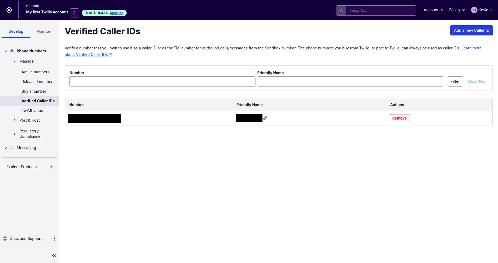

# LABORATORY-TWILIO

## Experiences

The information for connecting the code to our account are all shown on the dashboard of our app.
Under the app that I am using for thie laboratory.


### Experience1: Sendind a SMS using twilio

For sending a sms using twilio, you need to add your number in the **Verified Caller IDs** if you are using the trial version.
You can find this in the tab `develop` -> Phone numbers -> Manage -> Verified Caller IDs.



In the `api` project, the app.tsx is responsible for sending a SMS.

```js
const accountSid = process.env.TWILIO_ACCOUNT_SID;
const authToken = process.env.TWILIO_AUTH_TOKEN;
const client = require("twilio")(accountSid, authToken);

app.post("/send-sms", async (req, res, next) => {
  const { number } = req.body;

  const message = await client.messages.create({
    body: "This is the ship that made the Kessel Run in fourteen parsecs?",
    from: process.env.TWILIO_NUMBER,
    to: number || process.env.MY_NUMBER,
  });

  res.json(number);
});
```

The log of the message can be see in the tab `Monitor` -> Logs -> Messaging


